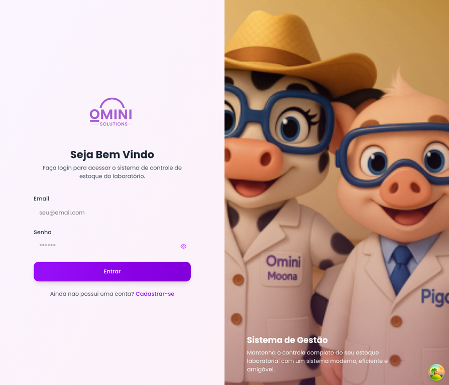
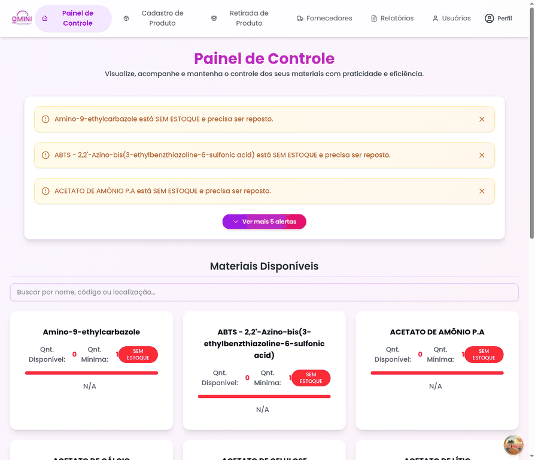
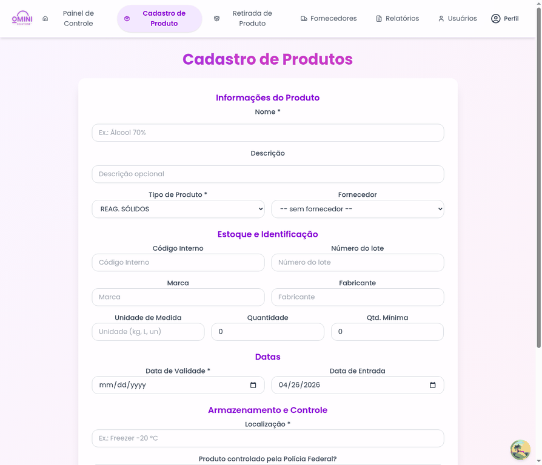
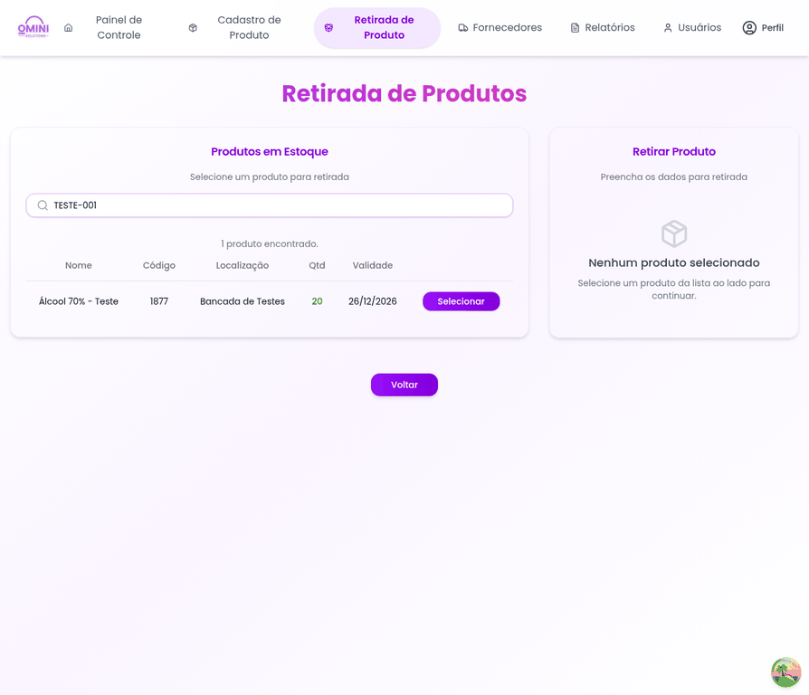
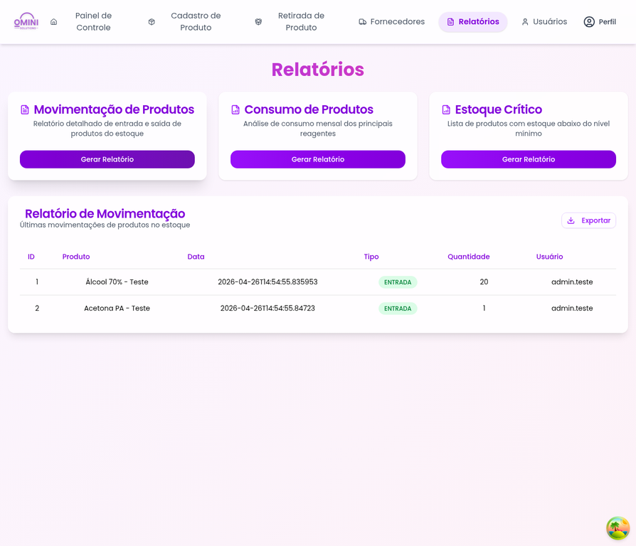
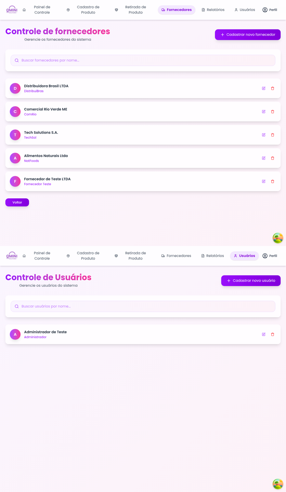

<p align="center">
  
</p>

<h1 align="center">Omini</h1>

<p align="center">
  Sistema full-stack para controle de materiais e reagentes em laboratórios.
</p>

<p align="center">
  <a href="#sobre-o-projeto">Sobre</a> |
  <a href="#funcionalidades">Funcionalidades</a> |
  <a href="#demonstracao-visual">Demonstração visual</a> |
  <a href="#tecnologias">Tecnologias</a> |
  <a href="#como-executar">Como executar</a>
</p>

## Sobre o projeto

O **Omini** é uma aplicação web criada para apoiar laboratórios acadêmicos e institucionais no controle de estoque de reagentes, materiais, equipamentos e fornecedores. O projeto nasceu na disciplina de Engenharia de Software (INF221) da Universidade Federal de Viçosa (UFV), em colaboração com equipes do Tecnopark de Viçosa - MG.

A proposta do sistema é reduzir perdas por vencimento, melhorar a rastreabilidade das retiradas, apoiar o planejamento de compras e centralizar informações que normalmente ficam espalhadas em planilhas ou controles manuais.

## Funcionalidades

- **Painel de controle** com listagem paginada, busca por nome/código/localização e cards de status do estoque.
- **Alertas operacionais** para produtos sem estoque ou abaixo do estoque mínimo.
- **Cadastro de produtos** com tipo, fornecedor, lote, fabricante, validade, localização, estoque mínimo e indicação de controle pela Polícia Federal.
- **Retirada de produtos** com validação de quantidade disponível, motivo obrigatório e atualização do estoque.
- **Movimentações de estoque** registradas no backend para entradas, saídas e ajustes.
- **Gestão de fornecedores** com busca e cadastro de dados comerciais.
- **Gestão de usuários** com perfis, status ativo e senha criptografada no backend.
- **Relatórios** para movimentação, consumo e estoque crítico, incluindo tabela e visualização gráfica.
- **API documentada** com Swagger UI e contrato OpenAPI.
- **Base inicial versionada** por Flyway, com tipos de produto, fornecedores e carga extensa de itens laboratoriais.

<a id="demonstracao-visual"></a>

## Demonstração visual

Os arquivos de demonstração ainda serão capturados. A convenção de nomes e o roteiro estão em [`docs/media/README.md`](docs/media/README.md).

Quando os assets forem adicionados, esta seção deve destacar os principais fluxos do produto:

- Login e identidade visual do Omini.
- Painel com busca, paginação, cards e alertas de estoque.
- Cadastro completo de produto laboratorial.
- Retirada de produto com validações.
- Relatórios e leitura de movimentações.
- Gestão de fornecedores e usuários.

<!--
Slots preparados para a vitrine visual:







-->

## Tecnologias

| Camada | Tecnologias |
| --- | --- |
| Backend | Java 21, Spring Boot 3.2.5, Spring Web, Spring Data JPA, Hibernate, Bean Validation, MapStruct, Lombok |
| Banco de dados | SQL Server 2019 via Docker, Flyway |
| API Docs | SpringDoc OpenAPI e Swagger UI |
| Frontend | React 19, TypeScript, Vite 6, Tailwind CSS, shadcn/ui, Radix UI, React Query, Axios |
| UI e dados | Recharts, lucide-react, date-fns |
| Testes | JUnit 5, Mockito, Spring Boot Test |
| Build | Maven e npm/Vite |

## Arquitetura em alto nível

```text
front/                 Aplicação React + TypeScript
src/main/java/         API REST Spring Boot
src/main/resources/    Configuração e migrations Flyway
docker-compose.yml     SQL Server para desenvolvimento local
```

O frontend consome a API em `http://localhost:8080/api` por meio da variável `VITE_API_URL`. O backend expõe recursos REST para produtos, movimentações, fornecedores, usuários, tipos de produto e alertas.

## Como executar

### Pré-requisitos

- Java 21
- Maven 3.9+
- Node.js 20+
- npm
- Docker e Docker Compose

### 1. Clone o repositório

```bash
git clone https://github.com/LucasMGcode/Omini.git
cd Omini
```

### 2. Suba o banco de dados

```bash
docker compose up -d
```

O `docker-compose.yml` disponibiliza o SQL Server em `localhost:1433` com as credenciais esperadas por `src/main/resources/application.properties`.

### 3. Execute o backend

```bash
mvn spring-boot:run
```

Serviços principais:

- API: `http://localhost:8080/api`
- Swagger UI: `http://localhost:8080/swagger-ui.html`
- OpenAPI JSON: `http://localhost:8080/v3/api-docs`

### 4. Execute o frontend

```bash
cd front
npm install
npm run dev
```

Frontend local: `http://localhost:5173`

O arquivo `front/.env` já define:

```env
VITE_API_URL=http://localhost:8080/api
```

## Rotas principais do frontend

| Rota | Tela |
| --- | --- |
| `/` | Login |
| `/dashboard` | Painel de controle |
| `/product-registration` | Cadastro de produto |
| `/withdraw-product` | Retirada de produto |
| `/supplier` | Fornecedores |
| `/supplier-registration` | Cadastro de fornecedor |
| `/users` | Usuários |
| `/user-registration` | Cadastro de usuário |
| `/reports` | Relatórios |

## Qualidade e validação

Comandos recomendados antes de publicar alterações:

```bash
mvn test
```

```bash
cd front
npm run build
```

## Documentação

A documentação histórica do projeto está na [Wiki do repositório](https://github.com/LucasMGcode/Omini/wiki), com materiais de escopo, arquitetura e instalação.

## Licença

Distribuído sob a licença MIT. Veja [`LICENSE`](LICENSE) para mais detalhes.
